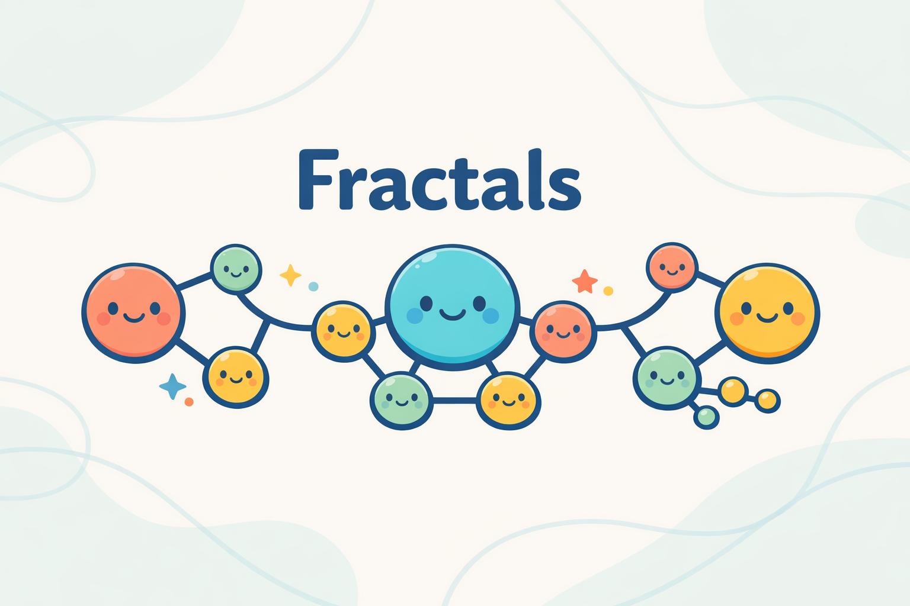
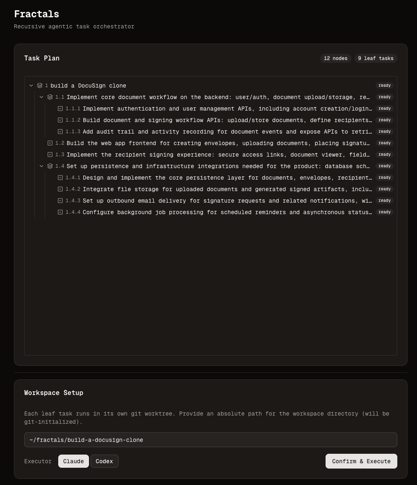

<div align="center">
  
  <h1>Fractals 🌀</h1>
  <p><strong>Recursive agentic task orchestrator</strong></p>
  <p><strong>Give it any high-level task and it grows a self-similar tree of executable subtasks, then runs each leaf in isolated git worktrees with an agent swarm.</strong></p>
  <p>
    
    <a href="https://opensource.org/licenses/MIT">
      
    </a>
    <a href="https://discord.gg/jH6AcEChuD">
      
    </a>
  </p>
</div>


<p align="center">
  
</p>

## Architecture

```
┌─────────────────────────────────────────────────────────┐
│  web/  (Next.js frontend)                               │
│  - Task input                                           │
│  - Tree visualization                                   │
│  - Workspace setup                                      │
│  - Execution status polling                             │
└────────────────────┬────────────────────────────────────┘
                     │ HTTP (:1618)
┌────────────────────▼────────────────────────────────────┐
│  src/  (Hono server)                                    │
│                                                         │
│  ┌─────────┐   ┌──────────┐   ┌──────────────────────┐  │
│  │ Codex   │   │Orchestr- │   │  Executor            │  │
│  │classify │──>│  ator    │   │  Codex / Claude CLI  │  │
│  │decompose│   │ plan()   │   │  git worktrees       │  │
│  └─────────┘   └──────────┘   └──────────────────────┘  │
│                                                         │
│  Codex CLI (structured)      Codex / Claude CLI (spawn) │
└─────────────────────────────────────────────────────────┘
```

## Two-Phase Flow

```
Phase 1: PLAN                          Phase 2: EXECUTE
─────────────────                      ──────────────────
User enters task                       User confirms plan
        │                              User provides workspace path
        v                                      │
  classify(task)                               v
  ┌──atomic──> mark "ready"            git init workspace
  │                                    create worktrees
  └──composite──> decompose(task)      batch leaf tasks
                      │                        │
                 [children]                    v
                      │                 codex exec / claude -p
                 plan(child) <────┐          "task + lineage context"
                      │           │          (per worktree)
                      └───────────┘
```

## UX Flow

1. **Input** -- enter a task description and max depth
2. **Decompose** -- server recursively breaks it into a tree
3. **Review** -- inspect the full plan tree before committing
4. **Workspace** -- provide a directory path (git-initialized automatically, defaults to `~/fractals/<task-slug>`)
5. **Execute** -- leaf tasks run via Codex CLI by default (Claude optional), status updates poll in real-time

## Batch Strategies

Due to rate limits, leaf tasks execute in batches rather than all at once.

| Strategy | Description | Status |
|----------|-------------|--------|
| **depth-first** | Complete all leaves under branch 1.x, then 2.x, etc. Tasks within each branch run concurrently. | Implemented |
| **breadth-first** | One leaf from each branch per batch. Spreads progress evenly. | Roadmap |
| **layer-sequential** | All shallowest leaves first, then deeper. | Roadmap |

## Project Structure

```
src/
  server.ts        Hono API server (:1618)
  types.ts         Shared types (Task, Session, BatchStrategy)
  llm.ts           Codex CLI planning: classify + decompose (structured output)
  orchestrator.ts  Recursive plan() -- builds the tree, no execution
  executor.ts      Codex / Claude CLI invocation per task in git worktree
  workspace.ts     git init + worktree management
  batch.ts         Batch execution strategies
  index.ts         CLI entry point (standalone, no server)
  print.ts         Tree pretty-printer (CLI)

web/
  src/app/page.tsx              Main UI (input -> review -> execute)
  src/components/task-tree.tsx  Recursive tree renderer
  src/lib/api.ts                API client for Hono server
```

## Quick Start

```bash
# 1. Install server deps
npm install

# 2. Install frontend deps
cd web && npm install && cd ..

# 3. Log in to Codex CLI
codex login

# 4. Start the server (port 1618)
npm run server

# 5. Start the frontend (port 3000)
cd web && npm run dev
```

Port `1618` — the golden ratio, the constant behind fractal geometry.

## Using Fractals On Another Repo

Fractals runs from this repo, but it operates on a target workspace that can be any local git repo.

Example target repo:

```text
C:\Users\ColsonR\lrsl-driller
```

Typical workflow:

1. Make sure the target repo is already a git repo and is on the branch you want to branch from.
2. Commit or stash any in-progress changes in the target repo first.
3. Start Fractals from this repo:

```bash
cd C:\Users\ColsonR\fractals
npm run server
cd web && npm run dev
```

4. Open `http://localhost:3000`
5. Enter a task that clearly references the target project, for example:

```text
In the lrsl-driller repo, add a new drilling summary panel and wire it to the existing results flow.
```

6. Review the generated task tree.
7. When Fractals asks for a workspace path, enter the target repo path:

```text
C:\Users\ColsonR\lrsl-driller
```

What happens next:

- Fractals uses the target repo as the workspace.
- If the repo already has `.git`, Fractals will not re-initialize it.
- Fractals creates worktrees under `.worktrees/` inside the target repo.
- Each leaf task runs on its own branch, such as `task/1.1`, `task/1.2`, and so on.
- Each leaf task makes its own commit in its own worktree.

Current limitation:

- Fractals does not merge those task branches back together yet.
- After execution finishes, you still need to inspect the result and merge or cherry-pick the generated branches yourself.

CLI note:

- `npm run cli "your task"` only prints the planned task tree right now.
- The full plan-and-execute workflow currently lives in the server and web UI.

## API

| Endpoint | Method | Description |
|----------|--------|-------------|
| `/api/session` | GET | Current session state |
| `/api/decompose` | POST | Start recursive decomposition. Body: `{ task, maxDepth }` |
| `/api/workspace` | POST | Initialize git workspace. Body: `{ path }` |
| `/api/execute` | POST | Start batch execution. Body: `{ strategy? }` |
| `/api/tree` | GET | Current tree state (poll during execution) |
| `/api/leaves` | GET | All leaf tasks with status |

## Configuration

| Env Variable | Default | Where | Description |
|---|---|---|---|
| `CODEX_BIN` | auto-detect | `.env` | Optional explicit path to the Codex CLI binary or shim. |
| `CLAUDE_BIN` | auto-detect | `.env` | Optional explicit path to the Claude CLI binary or shim. |
| `GIT_BIN` | auto-detect | `.env` | Optional explicit path to Git if it is not on PATH. |
| `PORT` | `1618` | `.env` | Server port. |
| `MAX_DEPTH` | `4` | CLI only | Max recursion depth. |
| `NEXT_PUBLIC_API_URL` | `http://localhost:1618` | `web/.env.local` | Server URL for frontend. |

## Roadmap

**Executor**
- [ ] OpenCode CLI as a third executor option
- [ ] Per-task executor override (mix Claude and Codex in one plan)
- [ ] Merge worktree branches back to main after completion

**Backpropagation (merge agent)**
- [ ] After all leaf tasks under a composite node complete, run a merger agent that combines their worktree branches into one cohesive result
- [ ] Propagate bottom-up: merge layer N leaves into layer N-1 composites, then merge those into layer N-2, all the way to root
- [ ] Merger agent resolves conflicts, wires modules together, ensures sibling outputs are compatible
- [ ] Final merge at root produces a single unified branch with the complete project

**Task dependencies & priority**
- [ ] Peer dependencies between subtasks -- declare that task 1.2 depends on 1.1's output (e.g., API must exist before frontend can call it)
- [ ] Dependency-aware scheduling -- respect declared ordering constraints when batching, run independent tasks concurrently but block dependents until prerequisites complete
- [ ] Priority weights -- allow marking subtasks as critical path vs. nice-to-have, execute high-priority tasks first within a batch
- [ ] LLM-inferred dependencies -- during decompose, have the LLM output dependency edges between sibling subtasks (structured output: `{ subtasks, dependencies }`)

**Batch strategies**
- [ ] Breadth-first batch strategy
- [ ] Layer-sequential batch strategy
- [ ] Configurable concurrency limit per batch

**Classify / decompose heuristics**
- [ ] User-defined heuristics -- inject custom rules into classify/decompose prompts (e.g., "always treat database migrations as atomic", "split frontend and backend into separate subtasks")
- [ ] Project-aware context -- feed existing codebase structure (file tree, package.json) into classify/decompose so the LLM knows what already exists
- [ ] Calibration mode -- let users mark classify/decompose decisions as correct or wrong, use feedback to refine prompts over time

**UX**
- [ ] SSE/WebSocket for real-time tree updates (replace polling)
- [ ] Task editing -- modify/delete/re-decompose subtasks before executing
- [ ] Persistent sessions (SQLite/file-based)
- [ ] Multi-session support
